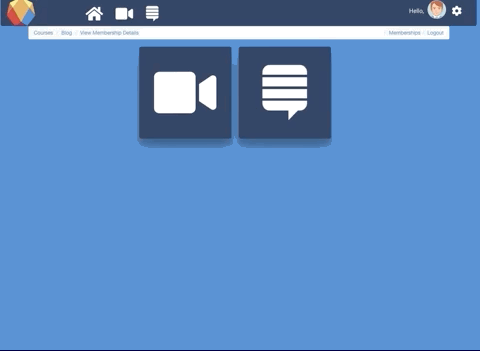
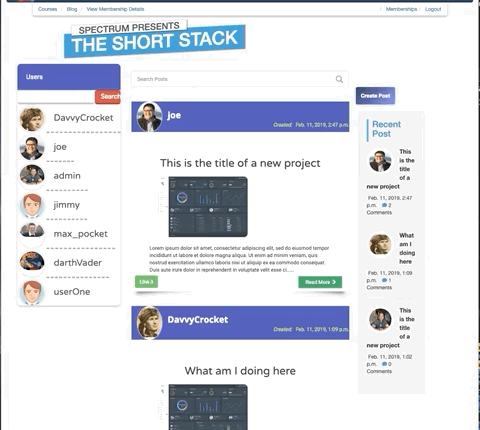
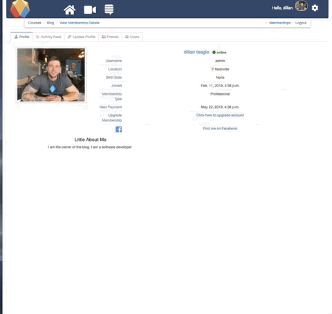

# Spectrum

The purpose of this application is to provide a basic social educational application for beginners at web/software development. This is a project for graduating Nashville Software School. Team Treehouse is the inspiration behind the model of this project.

## USER STORY
### AS A USER, I CAN...
+ create account
  - Register, Login, Logout


+ View another users profile

+ User Profile
  - update profile
    
  - view user blog history
  - view friends
  - view pending friend requests
  - view sent friend requests
  
  
  


+ view video footage
  - Courses of lessons available by membership

+ membership, upgrade membership
  - Free, Professional, Enterprise


+ Pay to upgrade your Subscription w/ Stripe API

 


+ View the blog "The Short Stack"
  - create a post, renders html, markdown, images, blockquotes, etc...
  - like a user's post
  - update or delete your own posts


+ Custom Comments
  -  Comment on a post
  - Parent & Child comments
  - Reply to a comment
  - Nested comment replies
  - Individual comment threads

  

## Getting Started

These instructions will get you a copy of the project up and running on your local machine for development and testing purposes. See deployment for notes on how to deploy the project on a live system.

### Prerequisites

You will Django 2.1 and
Python 3.6 or greater installed. Run the command below to check the version

```
pip show { name here }
```

### Installing

A step by step series of examples that tell you how to get a development env running

Clone down the repo

```
+ git clone   https://github.com/teaglebuilt/The-Coding-Rainbow.git

```
Create and start your environment

```
install your virtual Environment {virtualenv 'name'}

source name/bin/activate

```

Install dependencies

```

pip install -r requirements.txt

```

setup and run server

```
python manage.py migrate
python manage.py createsuperuser
python manage.py runserver

```


## Built With

* [Django](http://www.dropwizard.io/1.0.2/docs/) - Python Web Framework
* [Stripe](https://maven.apache.org/) - Payment Processing
* [Bootstrap](https://rometools.github.io/rome/) - CSS Framework

## Contributing

Please read [CONTRIBUTING.md](https://gist.github.com/PurpleBooth/b24679402957c63ec426) for details on our code of conduct, and the process for submitting pull requests to us.


## Authors

* **Dillan Teagle** - *Website* - [Github](https://github.com/teaglebuilt)


## Acknowledgments

* Thanks to Greg Korte and Joe Shepard from Nashville Software School.
